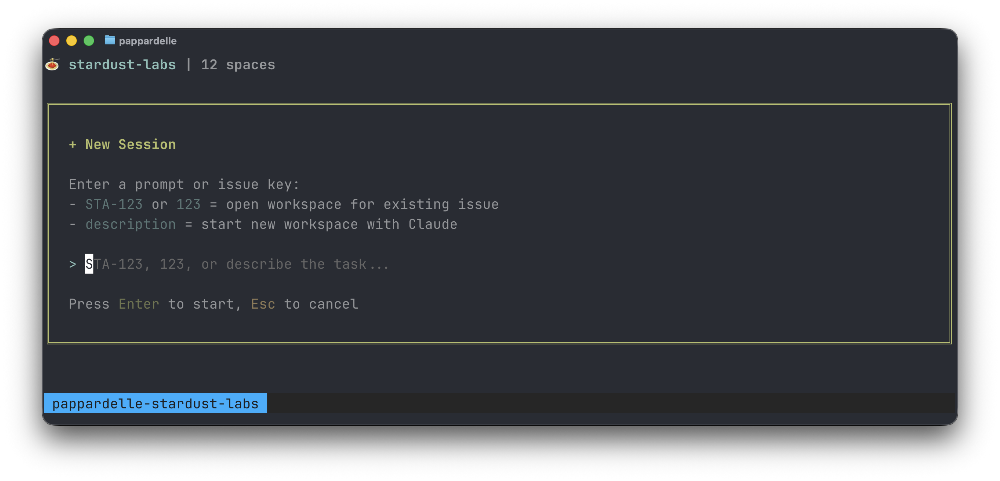
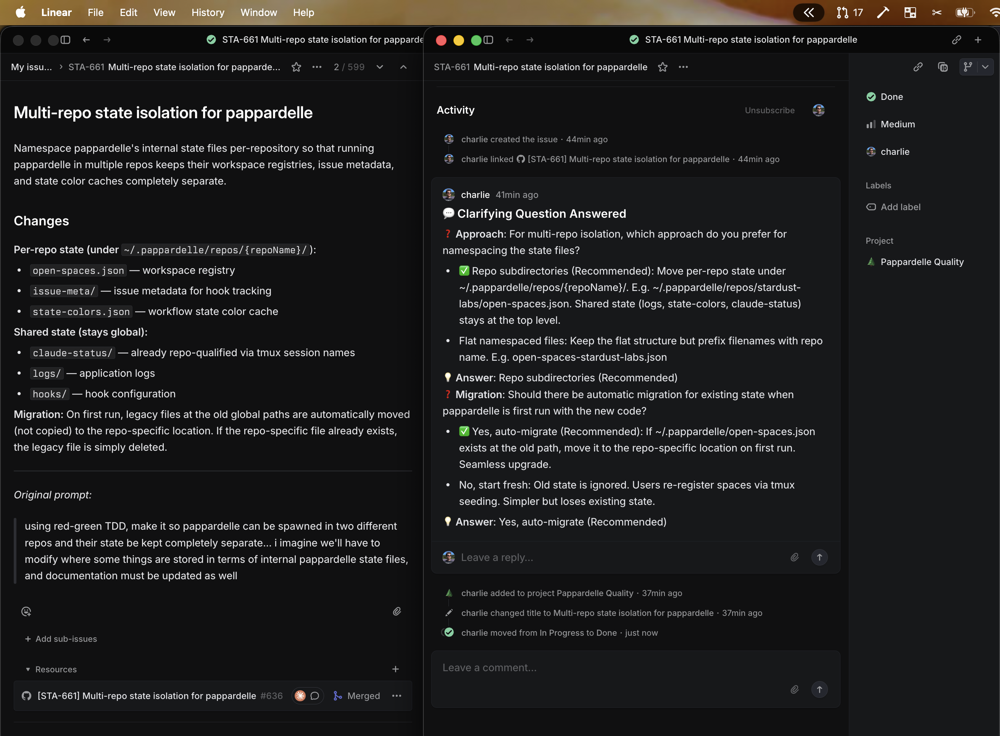

# 🦀🍝🦀 Pappardelle 🦀🍝🦀

[](https://github.com/chardigio/pappardelle/actions/workflows/test.yml)
[](https://nodejs.org/)
[](LICENSE)

A TUI for multi-clauding without losing your marbles.

You type a description, it reads or creates an issue in Linear/Jira, spawns a configured git worktree, builds a PR/MR, and starts a Claude Code session alongside a lazygit session — all wired together in a 3-pane tmux layout you can navigate with simple, customizable keystrokes.

**Video:**

https://github.com/user-attachments/assets/abeaf413-5a1e-448a-ac53-2956a8ada5bf

---

## Table of Contents

1. [Installation and Getting Started](#1-installation-and-getting-started)
2. [Understanding tmux in Pappardelle](#2-understanding-tmux-in-pappardelle)
3. [Spawning New Sessions](#3-spawning-new-sessions)
4. [Spec-Driven Development Mindset](#4-spec-driven-development-mindset)
5. [Customizing Your Configuration](#5-customizing-your-configuration)
6. [Advanced: Doom-coding with Pappardelle](#6-advanced-doom-coding-with-pappardelle)
7. [Advanced: Wrangling Multi-Repo Changes](#7-advanced-wrangling-multi-repo-changes)
8. [Reference](#8-reference)

---

## 1. Installation and Getting Started

### Set up with `/init-pappardelle`

The fastest way to get started is with the `/init-pappardelle` Claude Code skill. It installs Pappardelle, checks [prerequisites](#prerequisites), asks about your VCS host and issue tracker, and generates a `.pappardelle.yml` config — all in one interactive session.

Install the skill:

```bash
mkdir -p ~/.claude/skills/init-pappardelle && curl -fsSL https://raw.githubusercontent.com/chardigio/pappardelle/main/examples/skills/init-pappardelle/SKILL.md -o ~/.claude/skills/init-pappardelle/SKILL.md
```

Then run it from any repo where you want to use Pappardelle:

```bash
claude /init-pappardelle
```

For manual installation, see [Section 8: Reference](#8-reference). For the full config format, see the [configuration reference](pappardelle-config.md).

### Launch Pappardelle:

```bash
pappardelle
```


---

## 2. Understanding tmux in Pappardelle

### The 3-pane layout

When you launch `pappardelle`, it creates a tmux session with three panes:

- **Left pane** shows the ticket rail. This is where you navigate workspaces, create new ones, and trigger actions.
- **Center pane** shows the Claude Code session for whichever workspace is highlighted.
- **Right pane** shows [lazygit](https://github.com/jesseduffield/lazygit) for the highlighted workspace's worktree.

### How nested sessions work

Each workspace creates two independent tmux sessions:

- `claude-{repo}-{issue-key}` — runs Claude Code
- `lazygit-{repo}-{issue-key}` — runs lazygit

The center and right panes in the Pappardelle session are "viewers" — they run nested tmux clients that attach to these independent sessions. When you highlight a different workspace in the list, Pappardelle uses `tmux switch-client` to instantly swap which session the viewer pane displays.

This means:

- **Workspaces are independent.** Each Claude session runs in its own tmux session. If Pappardelle crashes, your Claude sessions keep running.
- **Attach from anywhere.** You can attach to any workspace's Claude session from a separate terminal: `tmux attach -t claude-stardust-labs-STA-631`.
- **Switching is instant.** After the first attachment, switching between workspaces uses tmux's fast `switch-client` path — no process restart, no visible flash.

### Recommended tmux config

Pappardelle works with any tmux configuration, but these settings improve the experience — mouse support, Ctrl+Shift+arrow pane navigation, and a clean status bar. See [`examples/tmux.conf`](examples/tmux.conf) and append to your `~/.tmux.conf`. If you don't have one yet:

```bash
curl -fsSL https://raw.githubusercontent.com/chardigio/pappardelle/main/examples/tmux.conf -o ~/.tmux.conf
```

### Exiting Pappardelle

Press `q` in the workspace list pane to quit. This kills the Pappardelle tmux session and all its viewer panes, returning you to your original terminal. Your Claude and lazygit workspace sessions are **not** affected — they run in independent tmux sessions and will keep going after Pappardelle exits. To reattach, just run `pappardelle` again.

To also kill all workspace sessions, use `Delete` on each workspace from the TUI before quitting, or nuke everything with:

```bash
tmux kill-server
```

---

## 3. Spawning New Sessions

### From the TUI

Press `n` in the workspace list to open the prompt dialog.



### What gets provisioned

When you create a workspace, Pappardelle runs through these steps:

1. **Profile selection** — Your input is keyword-matched against a profile in `.pappardelle.yml`.

2. **Issue creation/fetch** — For new descriptions, a Linear (or Jira) issue is created with a WIP title. For existing issue keys, the issue is fetched.

3. **Git worktree** — An isolated worktree is created at `~/.worktrees/{repo-name}/{issue-key}/`. This is a full working copy of your repo on a new branch, completely isolated from your main checkout.

4. **PR/MR creation** — A placeholder PR (GitHub) or MR (GitLab) is created from the new branch.

5. **Project setup** — Profile `commands` are executed (e.g., `xcodegen generate`, dependency installs). Top-level `post_worktree_init` commands also run after the worktree is created (e.g., copying `.env` files).

6. **Claude & lazygit sessions spawned** — A named tmux session is created and Claude Code is launched inside it. If `claude.initialization_command` is set in `.pappardelle.yml` (e.g., `/do`), that command is passed to Claude along with the issue key. A lazygit session rooted at the worktree dir is also spawned.

---

## 4. Spec-Driven Development Mindset



Pappardelle's recommended `/do` skill (set via `claude.initialization_command` in `.pappardelle.yml`) starts every Claude session with a **planning-first workflow**. Before writing any code, the agent researches and uses Claude Code's `AskUserQuestion` tool to clarify requirements — asking about ambiguous scope, confirming design decisions, and validating edge cases. The goal is to turn a rough prompt into a detailed, unambiguous spec — **written back to the issue description** — before the first line of code is written.

### Why this matters

A one-line prompt like "add dark mode to settings" leaves a lot of questions open: which settings screen? System preference or manual toggle? What colors? The `/do` skill instructs the agent to surface these questions upfront rather than guessing. This front-loaded clarification produces better code on the first pass and fewer revision cycles.

### Automatic Q&A documentation

Every `AskUserQuestion` exchange is automatically posted as a comment on the Linear or Jira issue by the [`comment-question-answered.py`](hooks/comment-question-answered.py) hook. This means:

- **The issue becomes the single source of truth.** The original prompt, every clarifying question, and every answer are all captured in one place — not scattered across chat windows or terminal scrollback.
- **Anyone reviewing the PR can see the full context.** The issue thread shows exactly what the agent asked, what the developer decided, and why.
- **Record-keeping is automatic.** You don't need to manually document decisions or copy-paste from the terminal. The hook handles it silently in the background.

---

## 5. Customizing Your Configuration

Pappardelle is configured via a `.pappardelle.yml` file at your repo root. The key concepts:

- **Profiles** — Per-project-type config (keywords, setup commands, VCS labels). Pappardelle keyword-matches your input to auto-select the right profile.
- **Template variables** — All string values support `${VAR_NAME}` expansion (`${ISSUE_KEY}`, `${WORKTREE_PATH}`, `${PR_URL}`, profile `vars`, env vars, etc.).
- **Custom keybindings** — Bind single keys to bash commands (`run`) or Claude directives (`send_to_claude`).
- **Providers** — Pluggable issue trackers (Linear, Jira) and VCS hosts (GitHub, GitLab). Defaults to Linear + GitHub.
- **Built-in file copies** — `.pappardelle.local.yml` and `.claude/settings.local.json` are automatically copied from the main repo to new worktrees (if they exist).
- **Post-worktree hooks** — Additional commands that run after worktree creation (e.g., copying `.env` files, installing dependencies).
- **Issue watchlist** — Auto-discover issues assigned to you and spawn workspaces for them. Pappardelle polls your issue tracker and creates workspaces for new matching issues.

For the full schema, all fields, and examples, see the [configuration reference](pappardelle-config.md).

For a production `.pappardelle.yml` used across a polyglot monorepo (Python backends + Swift iOS apps), see [`examples/monorepo-pappardelle.yml`](examples/monorepo-pappardelle.yml).

---

## 6. Advanced: Doom-coding with Pappardelle

**Video:**

https://github.com/user-attachments/assets/824307b7-73a6-48d2-918f-4a2d75fcb39b

Because Pappardelle runs entirely inside tmux, you can access your full workspace setup from anywhere — all you need is an SSH connection to the machine running it.

### What you need

- **A machine that stays on** — I'm not a Mac Mini guy (yet), I just keep my MacBook plugged in. macOS won't sleep with the lid closed as long as it has power and an active SSH session.
- **[Tailscale](https://tailscale.com/)** — A mesh VPN that makes your dev machine accessible from any network without port forwarding or firewall configuration. Install on both your dev machine and your mobile device.
- **[Termius](https://termius.com/)** (iOS) — A full-featured SSH client for iPhone and iPad with good tmux support, copy/paste, and keyboard shortcuts. Other SSH clients work too (Blink Shell, Prompt 3), but Termius handles tmux rendering well.


### Nice-to-haves

- **[ntfy](https://ntfy.sh/)** — Push notifications to your phone when Claude needs input. Pappardelle ships with a [`zap-notification.py`](hooks/zap-notification.py) hook that sends a push via ntfy whenever Claude asks a question or hits a permission prompt. To get it working, set the `PAPPARDELLE_NTFY_TOPIC` environment variable and subscribe to the same topic in the ntfy app on your phone — the hook only fires when an Tailscale SSH session is active. This way you don't have to babysit the terminal — just wait for the buzz.
- **[Wispr Flow](https://apps.apple.com/us/app/wispr-flow-ai-voice-keyboard/id6497229487)** — Voice-to-text dictation that works system-wide, including inside Termius. Lets you talk to Claude instead of thumb-typing on a phone keyboard.

### Useful keybindings

When you're doom-coding from your phone, you want one-tap access to open the PR on the device in your hand. Bind a key that sends an ntfy notification with a clickable link:

```yaml
keybindings:
  - key: 'z'
    name: 'Zap PR'
    run: >
      PR_NUM=$(gh pr list --head ${ISSUE_KEY} --json number -q '.[0].number' 2>/dev/null);
      if [ -n "$PR_NUM" ]; then
        curl -d "${ISSUE_KEY} GitHub PR #$PR_NUM"
          -H "Click: $(gh pr list --head ${ISSUE_KEY} --json url -q '.[0].url')"
          ntfy.sh/${PAPPARDELLE_NTFY_TOPIC};
      fi
```

Press `z` on a workspace and your phone buzzes with a notification — tap it and the PR opens in the GitHub app.

---

## 7. Advanced: Wrangling Multi-Repo Changes

Pappardelle is designed for single-repo workflows, but (experimentally) you can extend it to orchestrate changes across multiple repositories using a parent (pappa) repo.

### The setup

Create a parent repository that serves as the orchestration hub:

```
my-workspace/
├── .pappardelle.yml
├── .claude/
│   ├── settings.json         # shared settings + plugins
│   └── skills/
│       ├── do/
│       │   └── SKILL.md      # initialization skill
│       └── address-mr-feedbacks/
│           └── SKILL.md      # orchestration skill
└── CLAUDE.md
```

The parent repo's primary purpose is to share settings, context, and orchestration skills to coordinate work across child repos. Child repos are **not** committed to the parent — they're shallow-cloned on demand during workspace setup.

### Spawning agents in child repos

Multi-repo work has been an achilles heel for Claude Code in the past, but I'm hoping **[Agent Teams](https://code.claude.com/docs/en/agent-teams)** can help solve this. One key unlock with agent teams is that teammates can be spawned in _separate directories_, meaning we can have a parent repo, but then spawn an agent per relevant child repo, which is nice because it automatically loads that repo's CLAUDE.md, skills, settings, etc.

### On-demand shallow cloning

Repos are pulled down as needed — not upfront. During the planning phase, use a search tool like SourceBot's `codesearch` MCP to identify which repos are relevant, then shallow-clone only those:

```bash
git clone --depth 1 https://github.com/org/repo-a.git
```

This keeps initialization fast and reduces noise for the agent while it greps and globs. Because we use `--depth 1`, only the latest commit is fetched — no full history.

### Plugin skills vs. parent repo skills

One key distinction for multi-repo work is between plugin skills and parent repo skills:

- **Plugin skills** (added in the parent repo's `settings.json` but defined elsewhere) are skills that can be used by any repo / agent teammate receives automatically. These handle single-repo concerns.

  Example: An `/address-mr-feedback` plugin that lets any agent look at its own repo's MR and address reviewer comments.

- **Parent repo skills** (in the parent repo's `.claude/skills/`) are orchestration skills that spawn agent teams across child repos.

  Example: An `/address-mr-feedbacks` (plural) skill that spins up an agent team, spawning one agent per relevant child repo — each agent calls the plugin's singular skill for its own MR.

### Example `/do` skill for multi-repo

A starter `/do` skill tailored for multi-repo workflows is available at [`examples/skills/do-multi-repo/SKILL.md`](examples/skills/do-multi-repo/SKILL.md). It covers shallow cloning, agent team spin-up, per-repo QA, and coordinated PR creation. Install it into your parent repo with:

```bash
mkdir -p .claude/skills/do && curl -fsSL https://raw.githubusercontent.com/chardigio/pappardelle/main/examples/skills/do-multi-repo/SKILL.md -o .claude/skills/do/SKILL.md
```

### Useful keybindings

Bind keys to open specific child repos in your editor for quick navigation:

```yaml
keybindings:
  - key: 's'
    name: 'Open repo-a in Cursor'
    run: 'open -a "Cursor" "${WORKTREE_PATH}/repo-a" 2>/dev/null || open -a "Cursor" "${REPO_ROOT}/repo-a"'
```

Note the fallback to `${REPO_ROOT}/repo-a` here ensures this shortcut works in the `master`/`main` space.

---

## 8. Reference

### Prerequisites

| Tool                                                                   | Required | Install                                                            |
| ---------------------------------------------------------------------- | -------- | ------------------------------------------------------------------ |
| Node.js >= 18                                                          | Yes      | `brew install node`                                                |
| npm                                                                    | Yes      | Comes with Node.js                                                 |
| git                                                                    | Yes      | `brew install git`                                                 |
| tmux                                                                   | Yes      | `brew install tmux`                                                |
| jq                                                                     | Yes      | `brew install jq`                                                  |
| [Claude Code](https://docs.anthropic.com/en/docs/claude-code/overview) | Yes      | `curl -fsSL https://claude.ai/install.sh \| bash`                  |
| [linctl](https://github.com/raegislabs/linctl)                         | Optional | `brew tap raegislabs/linctl && brew install linctl` (for Linear)   |
| [gh](https://cli.github.com/)                                          | Optional | `brew install gh` (for GitHub)                                     |
| [glab](https://gitlab.com/gitlab-org/cli)                              | Optional | `brew install glab` (for GitLab)                                   |
| [acli](https://developer.atlassian.com/)                               | Optional | `brew tap atlassian/homebrew-acli && brew install acli` (for Jira) |

### Manual installation

If you prefer to install without the `/init-pappardelle` skill:

**One-line install:**

```bash
curl -fsSL https://raw.githubusercontent.com/chardigio/pappardelle/main/install.sh | bash
```

**From a local clone:**

```bash
git clone https://github.com/chardigio/pappardelle.git
cd pappardelle
./install.sh
```

**Manual install:**

```bash
git clone https://github.com/chardigio/pappardelle.git
cd pappardelle
npm install
npm run build
npm link                # makes `pappardelle` available globally
./hooks/install.sh      # installs Claude Code hooks for status tracking
```

**Directories created by the installer:**

| Directory / File                                        | Purpose                                              |
| ------------------------------------------------------- | ---------------------------------------------------- |
| `~/.pappardelle/`                                       | Config, hooks, logs, and Claude status files         |
| `~/.pappardelle/repos/{repoName}/open-spaces.json`      | Persisted workspace registry (per-repo, survives reboots) |
| `~/.pappardelle/repos/{repoName}/issue-meta/`           | Issue metadata for hook tracking (per-repo)          |
| `~/.pappardelle/claude-status/`                         | Real-time status JSON files from Claude hooks        |
| `~/.pappardelle/logs/`                                  | Daily log files (7-day retention)                    |
| `~/.worktrees/`                                         | Git worktrees for all your workspaces                |

> **Multi-repo support:** State is namespaced per repository under `~/.pappardelle/repos/{repoName}/`.
> Running pappardelle in two different repos keeps their workspace registries completely separate.
> On first run, existing state is automatically migrated from the legacy global location.

### Creating workspaces from the command line

You can create workspaces without launching the TUI using the `idow` ("interactively do on worktree") command:

```bash
# Create a workspace from a description
idow "add dark mode to settings"

# Create a workspace for an existing issue
idow STA-123
```

### Claude Code hooks

Pappardelle installs three Claude Code hooks that provide integration between Claude sessions and the TUI:

| Hook                           | Trigger                                       | What it does                                                                  |
| ------------------------------ | --------------------------------------------- | ----------------------------------------------------------------------------- |
| `update-status.py`             | `PreToolUse`, `PostToolUse`, `Stop`           | Writes session status to `~/.pappardelle/claude-status/` for live TUI updates |
| `comment-question-answered.py` | `PostToolUse` (AskUserQuestion)               | Posts Q&A exchanges as comments on the issue (Linear or Jira)                 |
| `zap-notification.py`          | `PreToolUse`, `PermissionRequest`             | Sends push notifications via ntfy when Claude needs user input                |

### Logging

Logs are written to `~/.pappardelle/logs/` with daily rotation (7-day retention):

```bash
# View today's log
cat ~/.pappardelle/logs/pappardelle-$(date +%Y-%m-%d).log

# Tail logs in real-time
tail -f ~/.pappardelle/logs/pappardelle-*.log

# View errors only
grep '\[ERROR\]' ~/.pappardelle/logs/*.log
```

Warnings and errors also appear in a red box at the bottom of the TUI. Press `e` to view them.

### Development

```bash
npm run dev      # Watch mode (auto-rebuild on changes)
npm run build    # Build once
npm start        # Run without building
npm test         # Lint + format check + tests
```

### Integration tests

Standalone scripts in `integration-tests/` verify providers against real instances. They are **not** ava tests and are never run in CI — use them for local verification after making provider changes.

```bash
npx tsx integration-tests/verify-linear.ts     # Linear provider (linctl)
npx tsx integration-tests/verify-jira.ts       # Jira provider (acli)
npx tsx integration-tests/verify-github.ts     # GitHub PR detection (gh)
npx tsx integration-tests/verify-gitlab.ts     # GitLab MR detection (glab)
npx tsx integration-tests/verify-config.ts     # Config loading + validation
npx tsx integration-tests/verify-watchlist.ts  # Full watchlist pipeline end-to-end
npx tsx integration-tests/verify-comments.ts   # Comment posting (creates real comments)
```

See [`integration-tests/README.md`](integration-tests/README.md) for env vars and prerequisites.

### Dependencies

- [Ink](https://github.com/vadimdemedes/ink) — React for CLIs
- [tmux](https://github.com/tmux/tmux) — Terminal multiplexer
- [lazygit](https://github.com/jesseduffield/lazygit) — Terminal git UI
- [Claude Code](https://docs.anthropic.com/en/docs/claude-code/overview) — AI coding assistant
